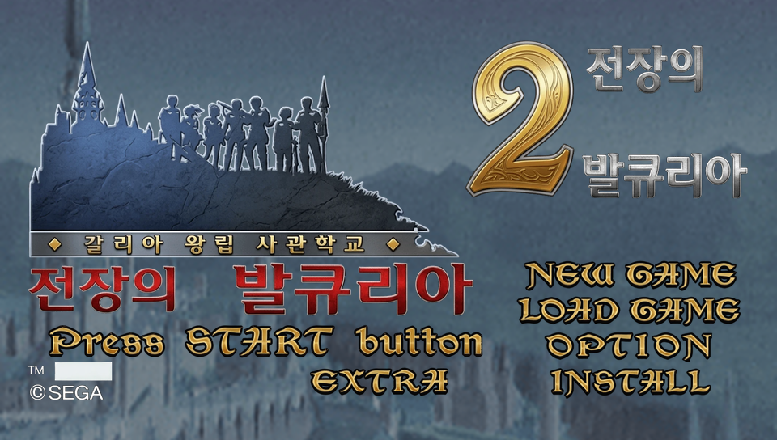

# 전장의 발큐리아 2 한글패치 (Valkyria Chronicles 2 — Korean Translation Patch)



**대상 게임:** 戦場のヴァルキュリア2 ガリア王立士官学校 (PSP, `NPJH50145`, v1.01)
**패치 버전:** v30 · **형식:** xdelta3 (VCDIFF) · **크기:** 54.2 MB

일본어판 PSP 게임을 한국어로 번역하는 **비공식 팬 번역 패치**입니다. 게임에 내장된 폰트의 한자 자리에 한글을 넣는 방식(wansung)으로, 별도 폰트 없이 게임 안에서 한글이 그려집니다.

> ⚠️ **이 저장소에는 게임 데이터가 들어 있지 않습니다.** 패치는 *차분(diff)* 파일이라 **본인이 합법적으로 소유한 원본 ISO**가 있어야만 적용·실행됩니다. 원본 없이는 아무 쓸모가 없습니다.

---

## ⚠️ 준비물 (Requirements)

본인이 직접 덤프했거나 소유한 아래 ISO가 필요합니다. **해시가 정확히 일치해야** 패치가 적용됩니다.

| 항목 | 값 |
|---|---|
| DISC ID | `NPJH50145` (일본판, v1.01) |
| 파일 크기 | `1,120,927,744` bytes |
| MD5 | `583a022cf364e93020abf13d69a76ef8` |
| SHA1 | `809a6a106aaf39d3a5aa18b5d7b0f7b70b6e1d65` |

패치 적용 후 결과물 ISO SHA1: `59f1ec0a61912223115258a2efb09821f74bc14e`

> 💡 **v30 (실기 동영상 재생 수정):** 자막 동영상이 PPSSPP에서는 되지만 **실기(PSP)에서 재생되지 않던 문제**를 고쳤습니다. 재인코딩한 PMF를 **코딩된 픽셀만 빼고 원본과 바이트 단위로 동일**하게 만들었습니다 — 원본의 팩 SCR·영상 PES 헤더·PTS·오디오·헤더를 그대로 재사용하고, 각 프레임을 원본과 같은 위치에 정렬해 실기 Media Engine의 버퍼 모델(SCR↔PTS)을 원본과 일치시켰습니다. H.264도 원본에 맞춤(Main@2.1·CABAC·ref1·B프레임 없음·weightp=0·AUD/HRD/pic_timing SEI). **이전 버전(v27~v29) 사용자는 v30으로 다시 적용하세요.**
>
> **동영상 자막·타이틀 화면**(v27부터): 타이틀 한글화 + 일본어 자막이 있는 영상 전부에 한국어 자막(원문 위/아래로 겹치지 않게 배치한 흰 글자+검은 테두리). 동영상 재인코딩이 포함되어 패치 용량이 큽니다.

---

## 📥 적용 방법 (How to Apply)

먼저 **[Releases](../../releases/latest)** 페이지에서 `VC2_KoreanPatch_v30.xdelta`를 내려받으세요 (용량이 커서 저장소가 아닌 릴리스에 첨부되어 있습니다). 이 패치를 원본 ISO에 적용하면 한글패치된 ISO가 만들어집니다. 세 가지 방법 중 편한 것을 쓰세요.

### 방법 1 — Delta Patcher (GUI, 권장 / recommended)
1. [Delta Patcher](https://github.com/marco-calautti/DeltaPatcher/releases) 다운로드
2. **Original file** = 원본 ISO, **XDelta patch** = `VC2_KoreanPatch_v30.xdelta` 선택
3. **Apply patch** 클릭 → 한글패치 ISO 생성

### 방법 2 — 파이썬 (Python, 크로스플랫폼)
```bash
pip install pyxdelta
python apply_patch.py "원본.iso"
```
→ `VC2_Korean_v30.iso` 생성 (해시 자동 검증)

### 방법 3 — xdelta3 명령줄 (CLI)
```bash
xdelta3 -d -s "원본.iso" VC2_KoreanPatch_v30.xdelta VC2_Korean_v30.iso
```

만든 ISO는 **PPSSPP**(권장) 또는 CFW PSP 실기에서 실행하세요.

---

## ✅ 번역 범위 (What's Translated)

게임 폰트로 그려지는 **거의 모든 텍스트**를 한글화했습니다:

- **모든 스토리 대사·이벤트** (오프닝~엔딩, 전 이벤트)
- **미션 이름 · 브리핑 본문 · 전투 중 대사/말풍선 · 전투 튜토리얼**
- **캐릭터명 · 병과명 · 무기명 · 차량명 · 아이템명**
- **UI / 메뉴 / 시스템 메시지 / 난이도·세이브 화면**
- **아카데미 허브 메뉴 + 백과사전**
- **타이틀 화면** (v27): 로고·부제·「Press START button」 등 타이틀 텍스처 한글화
- **동영상 한국어 자막** (v27): 일본어 자막이 있는 영상 전부(오프닝 프롤로그, 챕터/스토리 회상, 캐릭터 소개, 엔딩 프로필) — 원문을 가리지 않게 위/아래로 배치한 흰 글자+검은 테두리 하드섭
- **이미지에 구워진 텍스트 일부** (v26): 건강 경고 화면, 전투 결과 화면 라벨(전적 보고서·전투 성적·부대명·기본 전적·클리어 평가·턴/명/대/개 등), 세이브/인스톨 데이터 아이콘

## ⚠️ 알려진 제한 (Known Limitations)

- **이미지에 구워진 글자(일부):** 전투 HUD 라벨 등 일부 텍스처 글자는 일본어로 남습니다. 주요 화면(타이틀·경고·전투 결과·세이브 아이콘)과 동영상 자막은 한글화했습니다.
- **엔딩 크레딧 영상:** 실제 제작진·성우 이름이라 원본(일본어) 유지.
- 세이브 데이터 화면의 "データがありません"는 게임이 아니라 **PPSSPP 시스템 다이얼로그**입니다 (PPSSPP 언어 설정으로 변경).

## 🛠️ 직접 해보기 · 기술 자료 (Do-it-yourself / Technical materials)

이 저장소에는 **포맷 역분석 도구와 상세 기술 문서**가 함께 들어 있어, 다른 SJIS 기반
일본 게임을 패치하거나 이 패치를 재현·확장할 수 있습니다.

- **[`docs/TECHNICAL.md`](docs/TECHNICAL.md)** — CPK 암호, BF1 폰트, MTPA/MXE 포맷,
  wansung 한글 치환법, ★MXE 롤-암호화 영역 함정, 전체 파이프라인, 함정·교훈까지 총정리.
- **[`tools/`](tools/)** — 파이썬 역분석·패치 모듈(`vc2crypt`, `mxe_tool`, `mtpa_edit`,
  `vc2_font2b`, `wansung_encode`, `nested_runs`, `boottest`) + 사용법.
- **[`translation/`](translation/)** — **대사를 직접 바꿀 수 있는 번역 데이터**
  (`translations.json`, 편집 가능한 `{jp, ko}` 16,000여 항목) + 재빌드 스크립트
  (`rebuild.py`). 오역 수정·문체 변경·다른 번역본 제작에 쓰세요.

> 도구·재빌드는 **본인이 소유한 원본 ISO에서 추출한 파일**에 대해 동작하며, 게임 데이터는
> 포함하지 않습니다. `git`으로 clone 후 `docs/TECHNICAL.md`부터 읽으세요.

> ※ 배포 패치 `VC2_KoreanPatch_v30.xdelta`는 용량이 커서 저장소가 아니라 **Releases**에
> 첨부되어 있습니다. 받아서 `apply_patch.py`와 같은 폴더에 두세요.

```
vc2-korean-patch/
├─ apply_patch.py               # 파이썬 적용 스크립트 (해시 검증)
├─ docs/TECHNICAL.md            # 기술 문서
├─ tools/                       # 역분석·패치 도구 + README
├─ translation/                 # 편집 가능한 번역 데이터 + rebuild.py
└─ screenshots/
```

## 🙏 크레딧 (Credits)

- 번역·제작 / Translation & hacking: [@snake7594](https://github.com/snake7594)
- 리버스 엔지니어링 보조 / RE assist: Claude (Anthropic)
- 도구 / Tools: [YACpkTool](https://github.com/Brolijah/YACpkTool), UMD-replace (CUE), [xdelta3](https://github.com/jmacd/xdelta)
- 참고 / Reference: VC2 러시아어 팬패치 (team MOSAS)

## ⚖️ 법적 고지 (Legal / Disclaimer)

이 패치는 팬이 무보수로 만든 **비공식 번역**이며 세가(SEGA) 및 어떤 권리자와도 무관합니다. 저작권은 원저작권자에게 있습니다. 이 저장소는 **게임 데이터를 일절 포함하지 않으며**, 패치는 이용자가 합법적으로 소유한 원본에만 적용할 수 있는 차분 파일입니다. 패치된 ISO나 게임 데이터를 재배포하지 마세요. 문제 시 관련 파일을 내리겠습니다.

*This is an unofficial, non-commercial fan translation, not affiliated with SEGA. No game data is included; the patch is a diff applicable only to a copy you legally own. Do not redistribute patched ISOs or game data.*
